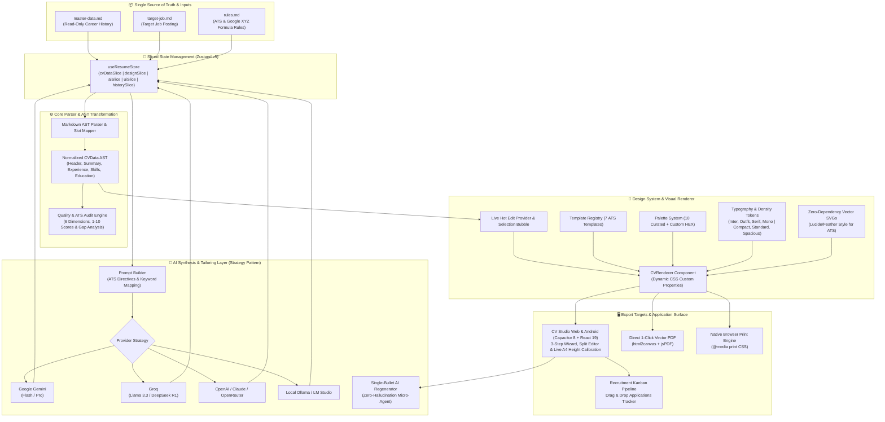

# 🚀 CV Studio & Tailor Engine (v1.0)

<div align="center">

[](https://react.dev)
[](https://www.typescriptlang.org)
[](https://vitejs.dev)
[](https://mui.com)
[](#-internationalization-i18n---5-locales)
[](#-core-capabilities--feature-matrix)
[](LICENSE)

<p align="center">
  <strong>Multiply your interviews by tailoring your resume in seconds.</strong><br>
  An intelligent, local-first ATS resume studio designed to tailor career histories to target job openings with quantifiable Google XYZ-formula bullets, real-time quality audits, in-place live hot editing, an integrated Kanban job tracker, and pixel-perfect 1-page A4 PDF exports.
</p>

[✨ Live Features](#-core-capabilities--feature-matrix) • [🏛️ Architecture](#️-system-architecture) • [🚀 Quick Start](#-quick-start--usage) • [🎨 Templates & Themes](#-visual-themes-reference-7) • [🌐 Internationalization](#-internationalization-i18n---5-locales) • [📦 Deployment](#-cloud-deployment-vercel)

</div>

---

## 🌟 Why CV Studio?

Traditional resume builders lock your data in proprietary cloud databases, charge recurring subscriptions, and produce generic resumes that fail automated **Applicant Tracking Systems (ATS)** screening.

**CV Studio** is engineered as a privacy-respecting, local-first power tool for engineers, leaders, and ambitious professionals:
- 🔒 **100% Privacy & Local-First:** Your data, master profile, API keys, and job applications never leave your browser or local machine.
- 🎯 **ATS Integrity & Zero Hallucinations:** Strictly preserves the candidate's single source of truth (SSOT). Adapts phrasing and highlights relevant skills without fabricating fake credentials.
- ⚡ **Sub-Second Tailoring:** Transform a job vacancy into an ATS-calibrated, interview-winning resume in < 60 seconds.
- 📄 **What You See Is What Prints:** Visual A4/Letter page boundary guides, dynamic pixel measurement, and 1-click **Magic Auto-Fit** ensure your resume never splits awkwardly across 2 pages.

---

## ✨ Core Capabilities & Feature Matrix

| Feature | Description | Status |
| :--- | :--- | :---: |
| 🗂️ **Local PDF & File Importer** | 100% client-side parser that extracts career history from PDF, .md, or .txt directly in-browser. 
| 🧙 **3-Step Guided Wizard** | Visual guided profile form + raw Markdown editor with real-time bi-directional synchronization. 
| 🤖 **Multi-Provider AI Strategies** | Supports Local AI (Ollama/LM Studio), Google Gemini, Groq, OpenAI (GPT-4o/o3-mini), Anthropic Claude, & OpenRouter. 
| ✍️ **Live Hot Editing & Selection Bubble** | Click any bullet or text directly on the rendered A4 canvas to edit, format (`Ctrl+B`, `Ctrl+I`, highlight), or regenerate with AI. 
| 📊 **Interactive Kanban Pipeline** | Full recruitment pipeline board (Wishlist, Applied, Interview, Offer) with version linking, metrics & analytics. 
| 🔍 **ATS  Gap Audit Engine** | 6-dimension scoring matrix (1-10), Google XYZ formula compliance, keyword cloud, and 1-click action levers. 
| 🎨 **7 Engineered ATS Templates** | 7 layout themes (Modern Tech, Executive, Minimal ATS, Two-Column, Designer, Formal Legal, Academic Research). 
| 🌈 **10 Curated Palettes + Custom HEX** | WCAG AA compliant color themes with dark/light mode and custom brand color picker. 
| 🌐 **5-Language Internationalization** | Complete multilingual UI with instant locale switching (`English`, `Español`, `Deutsch`, `Français`, `Italiano`). 
| 🖨️ **High-DPI Vector PDF Engine** | Direct 1-click in-browser vector PDF generator (`html2canvas` + `jsPDF`) and native browser print with sub-millimeter margins. 

---

## 🏛️ System Architecture

The engine is engineered around strict software design principles (**SOLID**, **DRY**, **Separation of Concerns**) and clean layer decoupling:



---

## 📁 Project Directory Layout

```text
customs-CVs/
├── master-data.md               # 🗂️ Master career dossier (SSOT: Projects, metrics, stack)
├── rules.md                     # 📜 ATS rules, STAR/Google XYZ formula & writing constraints
├── target-job.md                # 🎯 Active job posting requirements and company details
├── outputs/                     # 📤 Generated tailored CVs, Gap Reports, and vector PDFs
├── prompts/                     # 🤖 Standalone AI prompt templates
├── src/
│   ├── app/                     # Main Application root & layout orchestrator (App.tsx)
│   ├── components/              # Universal React components (CVRenderer, Icons, Slots)
│   │   ├── atoms/               # Pure presentational UI elements (MatchScoreBadge, StatusDot)
│   │   ├── molecules/           # Reusable interactive composites (SearchBarWithClear)
│   │   ├── slots/               # Standardized CV document template slots (Header, Experience)
│   │   ├── landing/             # Welcome & Onboarding view
│   │   └── studio/              # CV Studio Web & Mobile UI
│   ├── constants/               # Curated palettes, typography tokens, and project links
│   ├── core/                    # Core business logic & services
│   │   ├── ai/                  # AI Strategy pattern, prompt builder & bullet regenerator
│   │   ├── parser/              # Markdown AST parser, serializer & slot mapper
│   │   ├── audit-engine.ts      # 6-dimension quality & ATS audit evaluator
│   │   ├── pdf-extractor.ts     # 100% Client-side local PDF parser (pdfjs)
│   │   └── browser-pdf-generator.ts # In-browser direct vector PDF generator (html2canvas/jsPDF)
│   ├── hooks/                   # Custom stateful hooks & domain facades
│   ├── i18n/                    # i18next configuration & 5 JSON locale directories
│   ├── store/                   # Sliced Zustand store (cvData, design, ai, ui, history)
│   ├── styles/                  # Clean vanilla CSS design tokens (tokens, preview, print)
│   ├── templates/               # 7 Professional CV visual templates & template registry
│   ├── theme/                   # Centralized design tokens (colors, dimensions, MUI theme)
│   └── types/                   # Strict TypeScript interfaces & shared domain types
├── index.html                   # CV Studio Web entry point with OpenGraph SEO meta
├── package.json                 # Scripts and dependency declarations
└── vite.config.ts               # Vite server configuration
```

---

## 🚀 Quick Start & Workflows

### 1. Interactive Studio Web UI (Vite + React 19)

Start the local development server with instant Hot Module Reloading (HMR):
```bash
npm install
npm run dev
```
Open [http://localhost:5173](http://localhost:5173) in your browser.

---

### 2. Native Android App (Capacitor 8)

Synchronize the web application with the native Android project:
```bash
# Build web assets and sync to native Android platform
npm run cap:sync

# Open project in Android Studio to build APK or run in emulator
npm run cap:open
```

---

### 3. AI Tailoring: Any Provider or 100% Free Manual Mode

CV Studio supports flexible AI workflows without locking you into a specific service:
- **Direct API Keys**: Configure Google Gemini, OpenAI, Groq, OpenRouter, or local Ollama/LM Studio endpoints in Settings.
- **Copy-Prompt Mode (Free & Privacy-First)**: CV Studio generates a tailored, ATS-calibrated prompt adhering to the Google XYZ formula. Copy it with one click, paste it into ChatGPT, Claude, DeepSeek, or any local LLM, and paste the response back into the studio.

---

### 4. Direct 1-Click Vector PDF Export

- **1-Click PDF**: Download high-resolution vector PDFs rendered with `html2canvas` + `jsPDF` directly in your browser or Android device without external servers or headless browser processes.
- **Native Print**: Utilize `@media print` with pixel-perfect A4 dimensions (794px × 1123px) for crisp browser printing.

---

## 🎨 Visual Themes Reference (7)

| Theme ID | Category | Layout | Recommended Roles | Description |
| :--- | :--- | :--- | :--- | :--- |
| `modern-tech` | Tech & Engineering | Single Column | Software Engineers, Cloud/DevOps, Tech Leads | Stripe/Linear inspired style with monospace badges & dense stack |
| `executive` | Leadership | Two Column (Banner) | C-Level, VPs, Directors, Management Consultants | Corporate Navy top banner with initials monogram box |
| `minimal-ats` | Universal ATS | ATS Linear | Workday, Taleo, Greenhouse enterprise screening | Zero-distraction linear monochrome for 100% parser accuracy |
| `two-column` | General Tech | Two Column (Sidebar) | Full-Stack Devs, Architects, Technical Leaders | High-contrast right sidebar with geometric monogram card |
| `designer-uiux` | Creative & Product | Two Column (Pastel) | Product Designers, UI/UX Specialists, Frontend Devs | Soft tinted card header with editorial asymmetric flow |
| `formal-legal` | Legal & Finance | Single Column (Serif) | Attorneys, Corporate Counsel, Investment Bankers | Prestigious classical serif typography and formal division rules |
| `academic-research` | Science & R&D | Two Column (Dual-Tone)| Research Scientists, PhDs, Engineering Managers | Dark charcoal sidebar with avatar badge and research layout |

---

## 🌈 Curated Color Palettes Reference (10)

All palettes meet **WCAG AA contrast** requirements and ensure body copy remains deep charcoal/black (`#0f172a` / `#1e293b`) for 100% ATS readability:

| Palette ID | Primary HEX | Best Suited Industry / Vibe |
| :--- | :--- | :--- |
| `corporate-blue` | `#2563eb` | Tech, Enterprise, Engineering, Cloud & Security (Default) |
| `accent-teal` | `#0d9488` | Fintech, Product Management, Growth & High-growth Startups |
| `editorial-black` | `#0f172a` | High-contrast monochrome, timeless, executive & 100% ATS clean |
| `minimal-slate` | `#64748b` | Refined cool steel neutral grey for minimalist technical roles |
| `modern-indigo` | `#6366f1` | Linear / Stripe inspired electric accent for modern SaaS |
| `executive-burgundy`| `#9f1239` | Leadership, Corporate Strategy, Private Equity & Legal |
| `forest-green` | `#16a34a` | Climate tech, Sustainability, Life Sciences & Healthcare |
| `warm-amber` | `#d97706` | Client Success, Operations, Media, Consulting & Architecture |
| `creative-coral` | `#ea580c` | UI/UX Design, Content Strategy & Consumer Product teams |
| `custom` | Custom HEX | Any bespoke company brand color configured via the Studio color picker |

---

## 🌐 Internationalization (i18n) - 5 Locales

CV Studio includes built-in internationalization across **5 major languages** with 100% key synchronization across all domain namespaces:

- 🇺🇸 **English (`en`)** — Default / Baseline
- 🇪🇸 **Español (`es`)**
- 🇩🇪 **Deutsch (`de`)**
- 🇫🇷 **Français (`fr`)**
- 🇮🇹 **Italiano (`it`)**

Locale is automatically detected from the browser and can be toggled in real time via the studio navbar language selector.

---

## 📦 Cloud Deployment (Vercel)

Deploy CV Studio to **Vercel** with zero server costs:

1. Push your repository to GitHub.
2. Open [Vercel Dashboard](https://vercel.com) and click **"Add New Project"**.
3. Select your repository. Vercel automatically detects the build configuration:
   - **Framework Preset:** Vite
   - **Build Command:** `npm run build`
   - **Output Directory:** `dist`
4. Click **Deploy**. Your studio will be live with instant global CDN delivery.

---

## 🛡️ Code Quality & Verification

Run strict TypeScript typechecking:
```bash
npm run typecheck
```

Build the optimized Vite production bundle:
```bash
npm run build
```

Run automated compliance, hygiene, and i18n parity audit:
```bash
npm run check:compliance
```

---

## 📄 License

MIT License © 2026 Daniel Corredor. Built with passion for engineers, designers, and leaders crafting bespoke career narratives.
